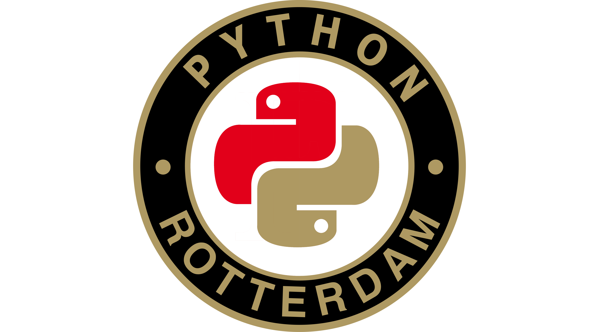

# meetup3

proceedings of the third rotterdam python meetup, Thursday September 26th at 42workspace.com

- Bas Nijholt: [instacron](https://github.com/basnijholt/instacron), see the presentation [with nbviewer](https://nbviewer.jupyter.org/github/Python-Meetup-Rotterdam/meetup3/blob/master/instacron-python-meetup.ipynb) or [with github nbviewer](https://github.com/Python-Meetup-Rotterdam/meetup3/blob/master/instacron-python-meetup.ipynb)
- Matthijs Beekman: [implementing type hinting at Viktor.ai](typehints/typehints.md)
- Artem Pulkin: "Micropython on GSM microcontroller". Porting and using micropython on a A9G (GSM+GPS microcontroller) so it may serve as a GPS tracker, remote weather station, modem, internet player or even a cell phone itself.
- Ricky Lim: [Interactive Visualizations](voila-meetup.pdf) using [voila](https://github.com/QuantStack/voila) with examples on [historical wealth distribution in the Netherlands](https://github.com/ricky-lim/wealth-nederland) and [exploring the bible](https://github.com/ricky-lim/ipybible)
