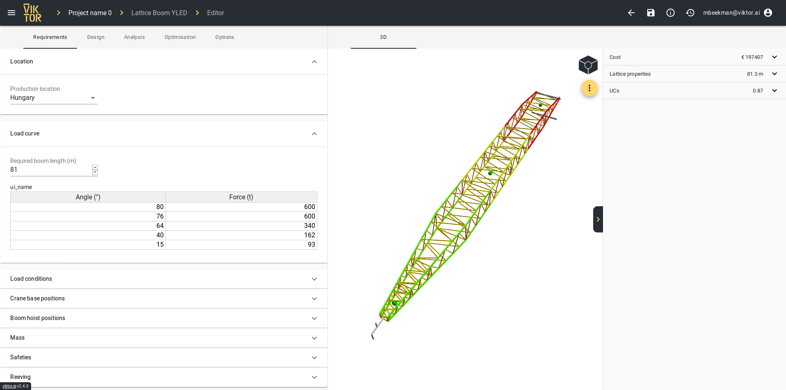
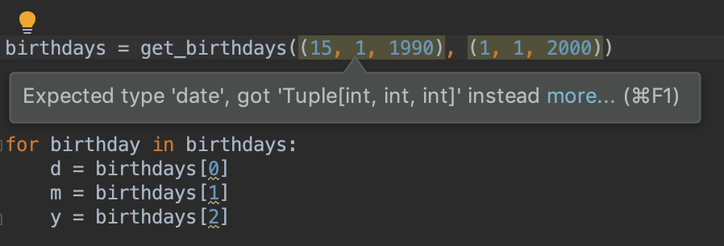
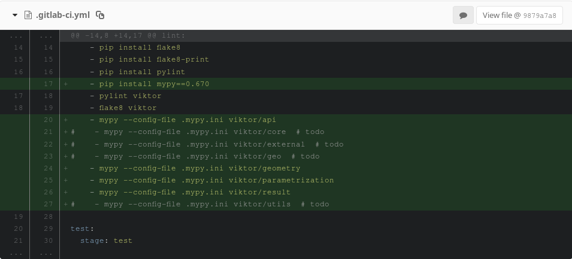
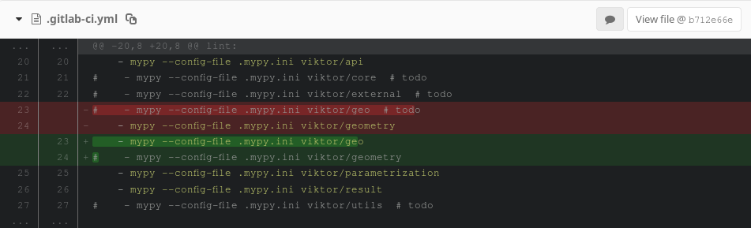
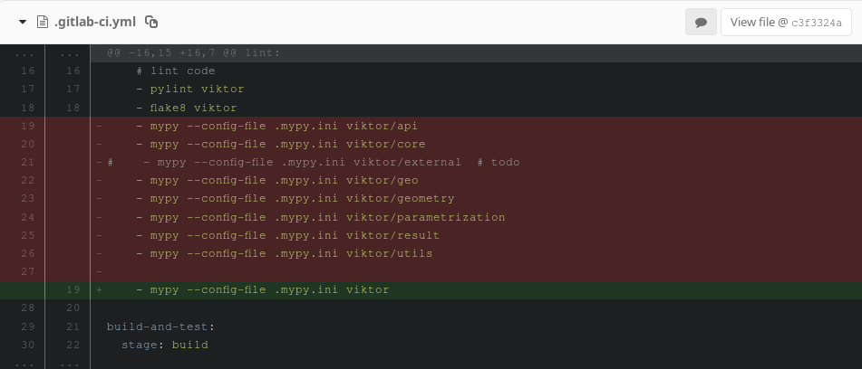

# Typehints
by: Matthijs Beekman
mbeekman@viktor.ai

---


- Software Engineer at [Viktor](https://viktor.ai)
- Viktor: engineering automation framework in python
- Python SDK

---




---

# Typehints

who knows typehints? who uses them?

- present since python3.5

example:

```python
def func(name: str) -> str:
	return f"Hello {name}"
```
- not enforced during runtime
- can be used by other tools (e.g. linters, static analysers)

(only python3 typehints in this talk)

---

# Content
- why typehints?
- type checkers
- mypy at Viktor
- typehint applications
- python3.8

---

# Why typehints?

- Readability

---

# Why typehints?

```python
def get_birthdays(start_date, end_date):

    """Get birthdays between start_date and end_date """
    calendar = {
        'Joe': datetime.date(year=1990, month=10, day=1),
        'Bill': datetime.date(year=1985, month=3, day=12),
        'Lara': datetime.date(year=1988, month=4, day=2),
    }
    
    return {name: date for name, date in calendar.items() if start_date < date < end_date}
 
```

Merge review:
- readable function name: check
- readable variable names: check
- docstring: check

---
# Why typehints?

```python
# tuples are clearly the logical choice here
birthdays = get_birthdays((15, 1, 1990), (1, 1, 2000))
```

```python
# or ISO string?
birthdays = get_birthdays('1990-01-15', '2000-01-01')
```
---
# Why typehints?

```python
def get_birthdays(start_date, end_date):
    """
    Get birthdays between start_date and end_date 

    :param start_date
    :type start_date: datetime.date
    :param end_date:
    :type end_date: datetime.date
    :returns: dictionary with names (str) and dates (datetime.date)
    """
    calendar = {
        'Joe': datetime.date(year=1990, month=10, day=1),
        'Bill': datetime.date(year=1985, month=3, day=12),
        'Lara': datetime.date(year=1988, month=4, day=2),
    }
    
    return {name: date for name, date in calendar.items() if start_date < date < end_date}
```

---
# Why typehints?

```python
def get_birthdays(start_date: datetime.date, end_date: datetime.date) 
-> Dict[str, datetime.date]:
    """ Get birthdays between start_date and end_date """
    calendar = {
        'Joe': datetime.date(year=1990, month=10, day=1),
        'Bill': datetime.date(year=1985, month=3, day=12),
        'Lara': datetime.date(year=1988, month=4, day=2),
    }
    
    return {name: date for name, date in calendar.items() if start_date < date < end_date}
```

```python
Date = datetime.date
def get_birthdays(start_date: Date, end_date: Date) -> Dict[str, Date]:
    """ Get birthdays between start_date and end_date """
    calendar = {
        'Joe': datetime.date(year=1990, month=10, day=1),
        'Bill': datetime.date(year=1985, month=3, day=12),
        'Lara': datetime.date(year=1988, month=4, day=2),
    }
    
    return {name: date for name, date in calendar.items() if start_date < date < end_date}
```
---
# Why typehints?
- Readability
- Enable deeper linting / static analysis




---


# Type checkers
automate checking source code type violations


13-09-2015:	PEP484 in python3.5

05-05-2016:	Dropbox:	Mypy
11-05-2018: Facebook:	Pyre
15-05-2018: Google:		Pytype
24-03-2019: Microsoft:	Pyright


---


- Dropbox with Guido van Rossum (inventor of python)
- Main author of PEP484
- https://github.com/python/mypy

```bash
$ mypy script.py
code2.py:18: error: Argument 1 to "get_birthdays" has incompatible type "Tuple[int, int, int]"; expected "date"
code2.py:18: error: Argument 2 to "get_birthdays" has incompatible type "Tuple[int, int, int]"; expected "date"
code2.py:23: error: Invalid index type "int" for "Dict[str, date]"; expected type "str"
code2.py:24: error: Invalid index type "int" for "Dict[str, date]"; expected type "str"
code2.py:25: error: Invalid index type "int" for "Dict[str, date]"; expected type "str"
```

---


- Facebook
- https://github.com/facebook/pyre-check. 
- mainly written in OCaml. motivations for implementation
	1. more speed for large codebases
	2. different architecture, similar to their PHP static analysis tools

```bash
$ pyre
 Æ› Found 4 type errors!
script.py:18:27 Incompatible parameter type [6]: Expected `datetime.date` for 1st anonymous parameter to call `code2.get_birthdays` but got `typing.Tuple[int, int, int]`.
script.py:23:18 Incompatible parameter type [6]: Expected `str` for 1st anonymous parameter to call `dict.__getitem__` but got `int`.
script.py:24:18 Incompatible parameter type [6]: Expected `str` for 1st anonymous parameter to call `dict.__getitem__` but got `int`.
script.py:25:18 Incompatible parameter type [6]: Expected `str` for 1st anonymous parameter to call `dict.__getitem__` but got `int`.
```

---
pytype
- Google
- https://github.com/google/pytype 
- motivations for own implementation:
	1. Pytype uses **inference** instead of gradual typing. This means it will infer types on code even when the code has no type hints on it.

	2. Pytype is **lenient** instead of strict. That means it allows all
operations that succeed at runtime and don't contradict annotations. 

```bash
$ pytype script.py
File "/Users/matthijs/typehint_presentation/script.py", line 18, in <module>: Function get_birthdays was called with the wrong arguments [wrong-arg-types]
  Expected: (start_date: datetime.date, ...)
  Actually passed: (start_date: Tuple[int, int, int], ...)
```

---
  

    
- Microsoft
- https://github.com/Microsoft/pyright
- Mixed typescript/python
- dependant on node, does not need python
- tight integration with VSCode

---
# mypy at Viktor - introduction
- started small with a few packages
- corrected errors / suppress checks
`# type: ignore`
`mypy.ini`
- added mypy check in ci:
`mypy --config-file mypy.ini viktor/package`




---
# mypy at Viktor - introduction
- activated per package
- run over complete library:
`mypy --config-file mypy.ini viktor`






---

# mypy at Viktor - latent bugs


---

# mypy at Viktor - currently
- missing typehints are added continuously
- typehints are required for every new callable
(checked during review)
- will enforce with mypy when coverage is great enough
---


# Why typehints?
- Readability
- Enable deeper linting / static analysis
- Finding latent bugs
---

# Automatic annotation for large codebases

- [Monkeytype](https://github.com/instagram/MonkeyType) by Facebook/Instagram:
- [PyAnnotate](https://github.com/dropbox/pyannotate) by Dropbox:


---
# Other typehint applications

- **runtime enforcement**
- compiler optimization
- finding security vulnerabilities

---
# Runtime enforcement

Not by language, but possible with packages:

```python
def some_function(a: int, b: str, c: List[Union[str, float]]) -> int:

    if not isistance(a, int):
        raise TypeError
    if not isinstance(b, str):
        raise TypeError
    if not isinstance(c, list):
        raise TypeError
    for item in c:
        if isinstance(c, (str, float)):
            raise TypeError

    return a+len(b)+len(c)
```
pytypes:
```python
@typechecked
def some_function(a: int, b: str, c: List[Union[str, float]]) -> int:
    return a+len(b)+len(c)
```
---
# Runtime enforcement
- Performance impact?

Multiple packages available:
- [pydantic](https://github.com/samuelcolvin/pydantic)
- [pytypes](https://github.com/Stewori/pytypes)
- [typeguard](https://github.com/agronholm/typeguard)
- [enforce](https://github.com/RussBaz/enforce) (no development since 2017)

---
# Other typehint applications

- runtime enforcement
- **compiler optimization**
- finding security vulnerabilities

---
# Compiler optimization

- Cython can use typehint to make better type guesses -> faster programs
- Raises TypeError on (some) builtin types: https://github.com/cython/cython/issues/3130

---
# Finding security vulnerabilities


---
# python3.8 and typehints

- [PEP589](https://www.python.org/dev/peps/pep-0589/): fixed keys in dict 
- [PEP544](https://www.python.org/dev/peps/pep-0544/): protocols / static ducktyping
- [PEP586](https://www.python.org/dev/peps/pep-0586/): literal types
- [PEP591](https://www.python.org/dev/peps/pep-0591/): final classifier
    - declare to not subclass
    - declare to not overwrite method 
    - declare to not re-assiging variable/attribute

---

# More info

- https://realpython.com/python-type-checking/
- https://www.youtube.com/watch?v=hWV8t494N88
- https://www.youtube.com/watch?v=pMgmKJyWKn8&
- https://www.bernat.tech/the-state-of-type-hints-in-python/